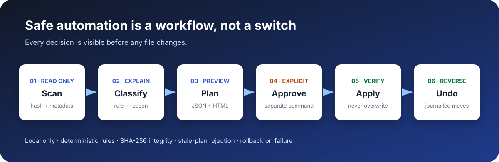

# Smart File Organizer

[](https://github.com/JithuVathiath/smart-file-organizer/actions/workflows/ci.yml)
[](https://www.python.org/)
[](pyproject.toml)
[](LICENSE)

**Local-first filesystem automation with explainable rules, dry-run previews, conflict-safe execution, transaction history, and one-command undo.**



Smart File Organizer is built around a simple principle: automation that touches personal files should be reviewable and reversible. It scans only a selected folder, explains every classification, creates an immutable JSON plan and shareable HTML preview, then requires a separate explicit command before moving anything.

> [!CAUTION]
> Start with the synthetic demo or a backed-up test folder. Version 1 never deletes or silently overwrites files, but no filesystem utility replaces an independent backup.

## Why this is more than a sorting script

| Concern | Engineering control |
| --- | --- |
| Accidental changes | Scan and plan are read-only; apply requires `--yes` |
| Silent overwrite | Exclusive destination creation and deterministic conflict policies |
| Changed file after preview | Size and SHA-256 stale-plan verification |
| Partial failure | Reverse-order rollback with failure details retained |
| Recovery | SQLite transaction history and preflighted undo |
| Path traversal | Every path is relative, normalized, resolved, and root-bounded |
| Project disruption | Git, Python, Node, Java, Go, and Rust projects are protected by default |
| Privacy | Dependency-free local processing; no network calls or telemetry |
| Unclear automation | Every action includes its rule, explanation, confidence, and conflict state |

## Try the safe demo

Python 3.11 or later is the only runtime requirement.

```bash
git clone https://github.com/JithuVathiath/smart-file-organizer.git
cd smart-file-organizer
python -m venv .venv
source .venv/bin/activate  # Windows: .venv\Scripts\activate
python -m pip install -e .

sfo demo /tmp/sfo-demo
```

The demo creates synthetic fixtures in a new directory, prints seven explained recommendations, and writes an HTML report. It does **not** apply the plan unless `--apply` is supplied.

```text
Plan eff7f1e964d6
Actions: 7 move, 0 skip, 0 review

[MOVE] Inbox/bank_statement_2025.pdf
       → Finance/Records/2025/bank_statement_2025.pdf
       financial-document keyword and supported document format

[MOVE] Inbox/conference_paper_2024.pdf
       → Research/Papers/2024/conference_paper_2024.pdf
       research-paper keyword and document format
```

Open the committed [real demo report](reports/demo-report.html) or inspect its source. The report was generated by the application from the repository's synthetic fixture, with the machine path redacted for privacy.

## Core workflow

### 1. Scan without changing anything

```bash
sfo scan ~/Downloads
```

Hidden files, symbolic links, internal state, dependency folders, and detected software projects are excluded by default.

### 2. Create a plan and visual preview

```bash
sfo plan ~/Downloads \
  --config examples/rules.toml \
  --output downloads-plan.json \
  --report downloads-plan.html \
  --redact-root
```

Supported conflict policies are `rename` (default), `skip`, and `review`.

### 3. Review, then apply explicitly

```bash
sfo apply downloads-plan.json
# Preview only; exits without changing files.

sfo apply downloads-plan.json --yes
# Applied plan … as transaction a1b2c3d4e5f6
```

The executor preflights the entire plan under an exclusive workspace lock. If a source changed or a destination appeared after planning, nothing starts.

### 4. Inspect history or undo

```bash
sfo history ~/Downloads
sfo undo a1b2c3d4e5f6 ~/Downloads       # preview
sfo undo a1b2c3d4e5f6 ~/Downloads --yes # restore
```

Undo first verifies every organized file and confirms that every original path is available.

### 5. Explain one file

```bash
sfo explain annual_report_2025.pdf
```

## Classification

Built-in rules cover financial records, research papers, documents, spreadsheets, presentations, images, audio, video, archives, structured data, source code, ebooks, and text. Unknown formats are retained under `Other/<extension>`—never discarded.

Custom rules use validated TOML:

```toml
[[rules]]
id = "cv-and-resume"
destination = "Career/CV/{year}"
priority = 500
explanation = "CV or resume keyword in a supported document"
confidence = "high"
extensions = ["pdf", "doc", "docx"]
name_contains = ["cv", "resume"]
```

See the [rule-language reference](docs/rule-language.md) and complete [example configuration](examples/rules.toml).

## Measured performance

This repository includes a reproducible benchmark that creates real temporary files, hashes every file with SHA-256, produces a full plan, and deletes the corpus afterward. Results below are from one local run on macOS 15.5, Apple arm64, Python 3.13.2.

| Files | Scan time | Scan throughput | Planning time | Plan throughput |
| ---: | ---: | ---: | ---: | ---: |
| 1,000 | 0.045 s | 22,350 files/s | 0.093 s | 10,785 files/s |
| 10,000 | 0.422 s | 23,684 files/s | 0.871 s | 11,486 files/s |
| 100,000 | 25.744 s | 3,884 files/s | 8.796 s | 11,370 files/s |

The result is transparent rather than generalized: disk, cache, filesystem, and security software materially affect scan speed. See the [raw benchmark result](reports/benchmark.json) and [methodology](docs/benchmarking.md).

## Quality evidence

- 72 tests passing locally
- 95% branch-aware code coverage
- Linux, macOS, and Windows CI across Python 3.11 and 3.13
- Unit, integration, failure-injection, CLI, and randomized path-safety tests
- Apply → verify → undo round-trip validation
- Mid-transaction failure and rollback test
- Distribution build and clean installed-command smoke test
- Ruff linting and formatting checks
- Zero runtime dependencies

Run the same checks:

```bash
python -m pip install -e ".[dev]"
python -m coverage run -m pytest -q
python -m coverage report --fail-under=90
ruff check .
ruff format --check .
python -m build
```

## Design and limitations

- [Architecture and move protocol](docs/architecture.md)
- [Safety, privacy, threat model, and limitations](docs/safety-model.md)
- [Rule language](docs/rule-language.md)
- [Benchmark methodology](docs/benchmarking.md)

The deterministic rule engine is intentional: it is auditable, fast, private, and reproducible. Semantic local classification, a desktop review interface, and filesystem-event monitoring are potential future extensions—not hidden dependencies in version 1.

## Repository map

```text
src/smart_file_organizer/  application and CLI
tests/                     safety, integration, CLI, and failure tests
examples/                  synthetic fixture and custom rules
benchmarks/                reproducible scale benchmark
reports/                   generated demo and raw benchmark evidence
docs/                      architecture, safety, rules, methodology
assets/                    recruiter-facing visual
```

## License

[MIT](LICENSE) © 2026 Jithu Vathiath Biju
